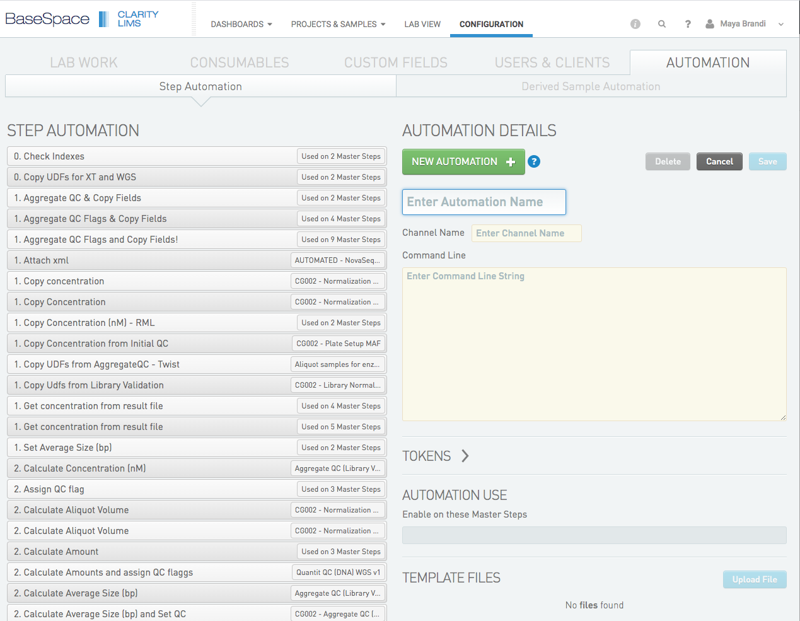
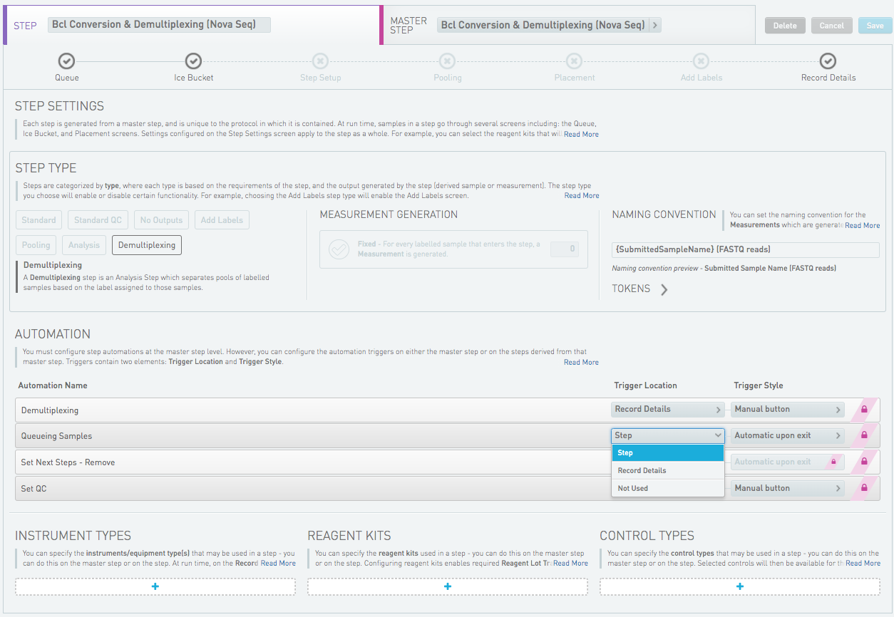

# clinical_EPPs 
## About

The External Program Plug-in (EPP) is a script that is configuerd to be run from within a lims step.

Clinical Genomics LIMS is using both scripts that are developed and maintained by Genologics, and scripts that are developed by developers at Clinical Genomics. Scripts developed and maintained by Clinical Genomics are collected in this repocitory.


## Branching model

clinical_EPPs is using github flow branching model as described in our development manual.


## Config files

The following config files are requiered.

#### ~/.genologicsrc
   
This config file contains user info to give access to the lims database and is requiered for the SciLifeLab/genologics package.
Its content must look like this:

```
[genologics]
BASEURI=
USERNAME=
PASSWORD=
```

#### ~/.clinical_eppsrc 

This config file contains userinfo to give access to cgstats which contins information about demultiplexing data. The config is used by one of the scripts in the Clinical-Genomics/clinical_EPPs package; bcl2fastq.py

Its content must look like this:

```
[demultiplex data]

SQLALCHEMY_DATABASE_URI=mysql+pymysql://remoteuser:<password>@127.0.0.1:<port>/cgstats
[CgFace]
URL=https://clinical-api.scilifelab.se/api/v1

```

## Production and Stage

Development of new EPPs is preferably be done locally but the final testing is done on the stage server.

The production lims system is set up on hippocampus and the stage lims system is set up on amygdala.

ssh into the servers:

`ssh gls@clinical-lims-stage.scilifelab.se`

`ssh gls@clinical-lims.scilifelab.se`

You will need a password wich is keppt in the safety locker at clinical genomics.

## Insalling
The procedure for installing is the same on both servers.

clinical_EPPs is cloned into `opt/nknknjk` and installed by the glsai user under the conda environment epp_master.

```
sudo -iu glsai
source activate epp_master

cd opt/clinical_EPPs
git pull <branch name>
python setup.py install

```
the branch that has been installed is now avalibe from within the [lims web interface](https://clinical-lims-stage.scilifelab.se/clarity/).


## Setting up a new EPP

The branch with the new script has been installed and you want ot test the script through the web interface. (Or deploy it on production. The procedure is the same.)

Go to the CONFIGURATON tab in the web interface and the select the AUTOMATION tab. Klick the NEW AUTOMATON button.

- Choose a Automation Name
- Channel Name should always be limsserver.
- Enter the command line string. If you need help selecting a token for an argument, klick the TOKENS tab.
- Under AUTOMATION USE, select master step(s) in which the new EPP should be available.
- Save



Once the EPP is in place on the master step you need to configure its usage. This can be done both on master step and on step level. 

Klick the LAB WORK tab and select a step in which you have enabeled the EPP. 


Choose STEP or MASTER STEP, and scroll down to the AUTOMATION section. The new EPP should be seen there. 


Select Trigger Location - at what point in the step the script should be run, and Trigger Style - how the script should be triggered.

The script is now avalible from within the step. Queue some samples to the step to try it!

Read more about EPPs in the [Clarity LIMS API Cookbook](https://genologics.zendesk.com/hc/en-us/restricted?return_to=https%3A%2F%2Fgenologics.zendesk.com%2Fhc%2Fen-us%2Fcategories%2F201688743-Clarity-LIMS-API-Cookbook)

